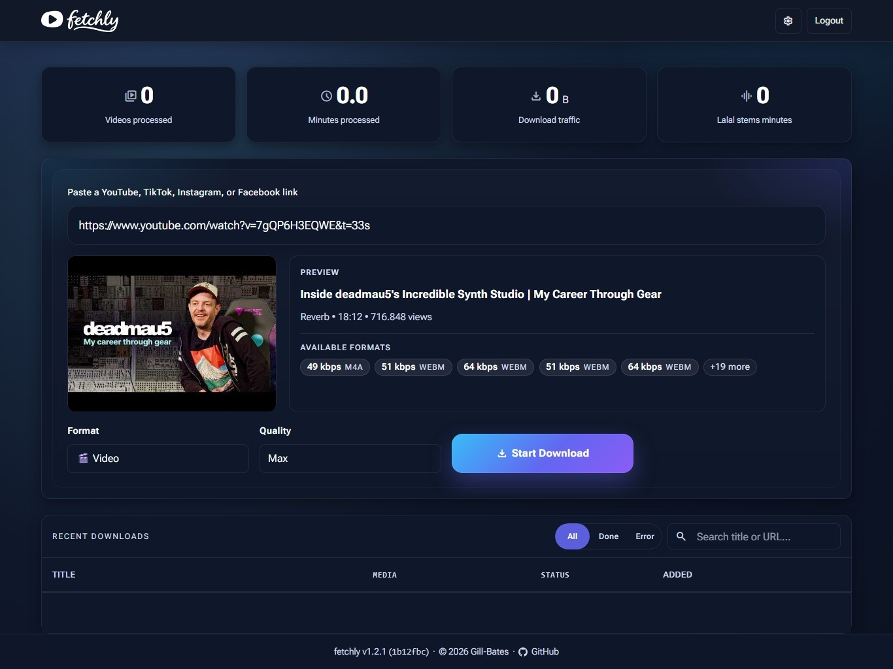
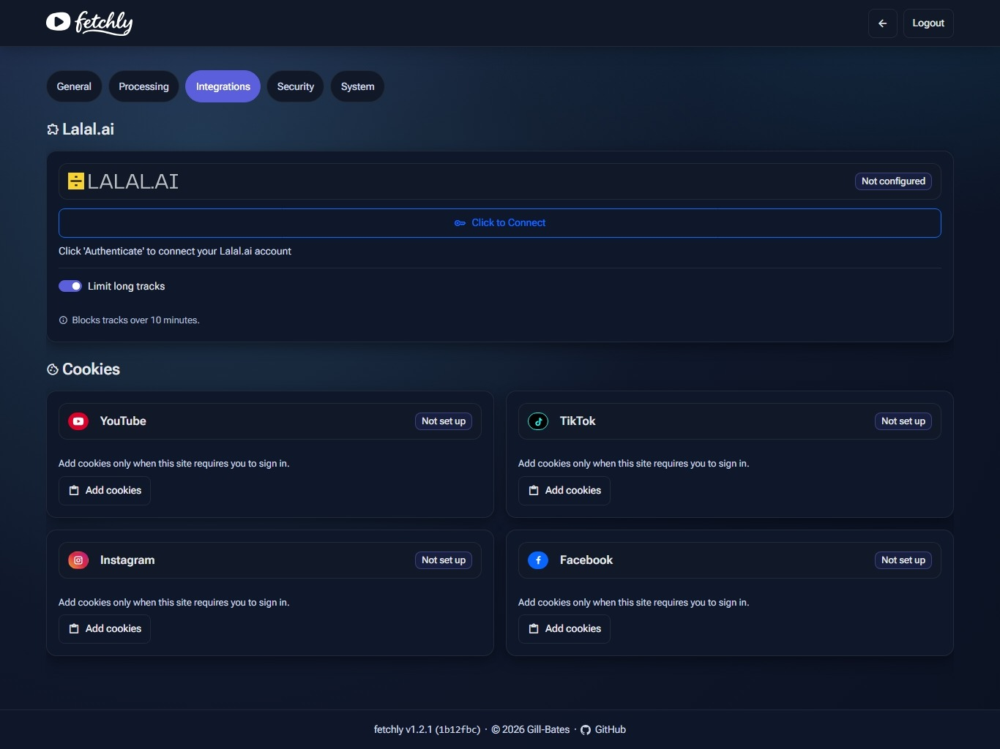
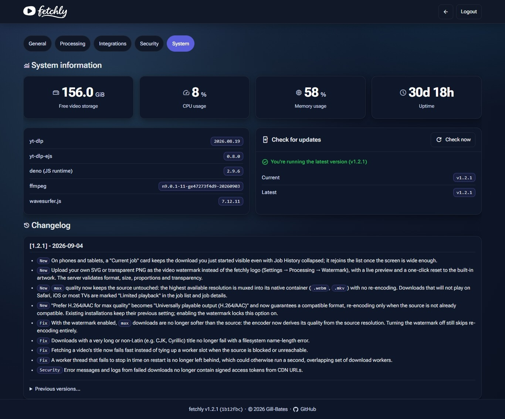

<p align="center">
  <picture>
    <source media="(prefers-color-scheme: dark)" srcset=".github/img/fetchly_white.svg">
    
  </picture>
</p>

<p align="center">
  <b>Self-hosted media downloader for YouTube, TikTok, Instagram &amp; Facebook.</b><br>
  Paste a link, preview it, pick a format — with a live job dashboard, waveform audio trimming, BPM analysis, and Lalal.ai stem separation.
</p>

<p align="center">
  <a href="https://github.com/Gill-Bates/fetchly/releases"></a>
  <a href="https://hub.docker.com/r/giiibates/fetchly"></a>
  <a href="https://hub.docker.com/r/giiibates/fetchly"></a>
  <br>
  <a href="LICENSE"></a>
  
</p>

---

<p align="center">
  <br>
  <em>Dashboard — paste a link, preview the media, pick a format, and track every job live.</em>
</p>

<p align="center">
  <br>
  <em>Authenticated login with invisible, server-verified anti-bot protection.</em>
</p>

<p align="center">
  <br>
  <em>Integrations — connect Lalal.ai for stem separation and paste browser cookies for sign-in-only downloads.</em>
</p>

<p align="center">
  <br>
  <em>System — host resources, component versions, one-click update checks, and the in-app changelog.</em>
</p>

## Download, shape, share

fetchly turns `yt-dlp` into a self-hosted media workspace. Pick formats in a web UI,
follow every job live, trim audio visually, find its tempo, create stems, and share
finished downloads without handing your media to another service.

## Features

| Feature | What you get |
| --- | --- |
| **Download everywhere** | Save video or audio from YouTube, TikTok, Instagram, and Facebook in one place. |
| **Stay in control** | Follow every queued, active, completed, or failed job from a live dashboard. |
| **Choose your quality** | Pick the format and quality you want, then let fetchly handle the conversion. |
| **Brand every video** | Burn the fetchly logo — or your own uploaded SVG or PNG — and your hostname, once set, into the corner of every downloaded video, or switch it off. |
| **Trim with precision** | Cut audio visually with an interactive waveform before you download or process it further. |
| **Find the tempo** | Analyze BPM and beat confidence, then use the result to guide audio trimming. |
| **Create clean stems** | Connect Lalal.ai to separate vocals and instrumentals when you need production-ready tracks. |
| **Share what you made** | Send friends and family a share link to a finished download — no account needed on their side, with an optional limit on how many times it can be used. |
| **Keep it private** | Run everything yourself with persistent storage, authentication, CSRF protection, anti-bot checks, and login rate limiting. |
| **Ready to run** | Get the complete application and its required dependencies in one Docker image. |

## Supported platforms

| | Platform | Video | Audio |
| --- | --- | --- | --- |
| <picture><source media="(prefers-color-scheme: dark)" srcset=".github/img/social/youtube_white.svg"></picture> | **YouTube** | ✅ | ✅ |
| <picture><source media="(prefers-color-scheme: dark)" srcset=".github/img/social/tiktok_white.svg"></picture> | **TikTok** | ✅ | ✅ |
| <picture><source media="(prefers-color-scheme: dark)" srcset=".github/img/social/instagram_white.svg"></picture> | **Instagram** | ✅ | ✅ |
| <picture><source media="(prefers-color-scheme: dark)" srcset=".github/img/social/facebook_white.svg"></picture> | **Facebook** | ✅ | ✅ |

> **Note:** Public URLs work without account cookies. Age- or login-gated content may work after importing a current signed-in session under **Settings → Integrations**; platforms can still reject stale or revoked sessions.

## Quickstart

Docker is the recommended way to run fetchly. The image ([Docker Hub](https://hub.docker.com/r/giiibates/fetchly)) bundles `ffmpeg`, `yt-dlp`, `yt-dlp-ejs`, and `deno` — nothing else to install.

### Docker Compose

```yaml
# compose.yaml
services:
  fetchly:
    image: giiibates/fetchly:latest
    container_name: fetchly
    restart: unless-stopped
    ports:
      - "8000:8000"
    environment:
      FETCHLY_SECRET_KEY: ${FETCHLY_SECRET_KEY:?generate with: openssl rand -base64 32}
    volumes:
      - ./data:/app/data
```

```bash
export FETCHLY_SECRET_KEY="$(openssl rand -base64 32)"
docker compose up -d
```

A fuller compose file with logging, timezone, and reverse-proxy notes lives in [`docker/docker-compose.yml`](docker/docker-compose.yml).

Open <http://127.0.0.1:8000>, then create an admin account in **Settings → Security**
before exposing fetchly beyond your local machine.

## Learn more

The [fetchly documentation](https://gill-bates.github.io/fetchly/) covers installation,
configuration, reverse proxies, security, platform cookies, the API, and troubleshooting.

---

<p align="center">
  <a href="https://www.buymeacoffee.com/tnsteinerx">
    
  </a>
</p>
