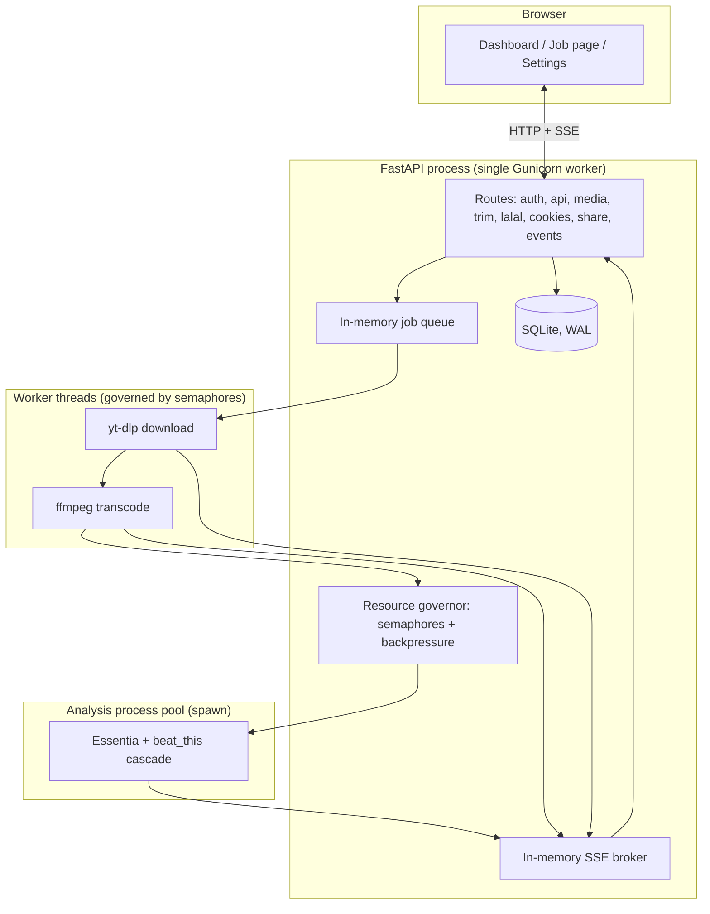

# Architecture

How fetchly is put together, and why it is deliberately a single process.

## Layers

## Why one process

`WORKERS=1` is enforced by the entrypoint, not just defaulted. Two structures live only
in this process's memory, with no cross-process coordination:

| Structure | If duplicated across processes |
|---|---|
| Job queue (`app/worker.py`) | The same job runs twice |
| SSE subscriber registry (`app/routes/events.py`) | A client's events go to a process that never sees its job |

This is a correctness boundary, not a performance one. Concurrency comes from
**threads and processes inside the one Gunicorn worker**, governed by the resource
governor — see [Resources & Workers](../configuration/resources.md).

## The job lifecycle

1. `POST /api/submit` validates the request, extracts a metadata preview (8 s budget),
   inserts a `queued` row (`app/db.py`), and pushes onto the in-memory queue
2. A worker thread (`app/worker.py`) picks it up, moves it through `processing` →
   `downloading` → `transcoding`, running yt-dlp and ffmpeg as subprocesses bounded by
   the governor's semaphores
3. Every status change is pushed onto an `asyncio.Queue` and fanned out to SSE
   subscribers by the event broadcaster background task
4. An audio job that finished transcoding is handed to the **analysis worker pool**
   (`app/analysis_worker.py`): a separate process, started with `multiprocessing`'s
   `spawn` context, runs the [BPM cascade](../features/bpm.md) and reports back over a
   `multiprocessing.Connection`. The job is `analysis` (already downloadable) until this
   finishes, then `analysis_done`
5. A job with no analysis step goes straight to `done`

See [Downloads](../features/downloads.md) and [Job Dashboard](../features/jobs.md).

## Why BPM analysis is a separate process

Essentia and `beat_this` are CPU- and memory-heavy, and — unlike yt-dlp/ffmpeg, which
are already separate OS processes — they run as Python code that would otherwise share
the FastAPI process's memory and GIL. Running them in a `spawn`ed child:

- keeps a crash or a memory spike from taking down the web server
- lets the governor bound concurrent analyses independently of concurrent
  downloads/transcodes (`ANALYSIS_SEMAPHORE_LIMIT`)
- makes the model checkpoint load once per child rather than per request

## Application startup (`app/main.py`)

The FastAPI `lifespan` context does, in order:

1. Check optional dependencies, create `DATA_DIR` and `DATA_DIR/cookies`
2. Initialize the database (`init_db`) — schema creation and migration
3. Cancel jobs left `processing`/`downloading`/`transcoding` from a previous run
   (the subprocess is gone; there is nothing to resume)
4. Configure the resource governor (CPU/memory detection)
5. Wire route modules together (each route module gets its dependencies via an
   `init_*` call instead of importing global state)
6. Start the download worker threads and the analysis process pool
7. Requeue jobs that were `queued` on disk but lost from the in-memory queue on restart
8. Start five background `asyncio` tasks: the event broadcaster, the hourly
   housekeeping sweep, a backlog scanner for analysis, a backlog scanner for
   downloads, and a settings-cache refresher

Shutdown reverses this: stop accepting new SSE connections, cancel background tasks,
stop the analysis pool and worker threads (with a grace period each), then close the
database — checkpointing the SQLite WAL. `GRACEFUL_TIMEOUT` in the container must be
generous enough for this whole sequence.

## The resource governor

`app/governor.py` detects the effective CPU allocation (cgroup-aware) and sizes worker
threads and semaphores accordingly, with backpressure that rejects new submissions
under memory pressure instead of accepting them into an unbounded backlog. Full detail
in [Resources & Workers](../configuration/resources.md).

## Data model

SQLite in WAL mode, three tables of note:

| Table | Holds |
|---|---|
| `jobs` | One row per download: URL, type, quality, status, metadata, BPM |
| `settings` | Key/value runtime configuration (see `app/db.py::_SETTINGS_DEFAULTS`) |
| `share_links` | Token, target job, use count, snapshotted max uses |

There is deliberately no `owner` column: fetchly is single-identity, and adding
multi-user support would start with this table. See
[Security Overview](../security/overview.md#threat-model).

## Route modules

Each `app/routes/*.py` file owns one family and is wired up in `main.py` via
`app.include_router(...)`. Route modules that need shared state (the data directory, a
templates engine, an event-enqueue callback) receive it through an explicit `init_*`
function called from `lifespan`, rather than importing a module-level global — this is
what keeps `TestClient(app)` usable without a full app boot in most tests.

| Module | Routes |
|---|---|
| `auth.py` | Login, logout |
| `api.py` | Jobs, settings, stats, system, thumbnails |
| `media.py` | Download, playback, job page |
| `trim.py` | Audio trimming |
| `lalal.py` | Lalal.ai auth and stem separation |
| `cookies.py` | Platform cookie import |
| `share.py` | Share link creation and redemption |
| `events.py` | SSE streams |

## Middleware

- `CSRFMiddleware` (`middleware/csrf.py`) — double-submit cookie on `/login`,
  `/logout`, and every state-changing route under the `/api` prefix
- `ProxyHeadersMiddleware` (Uvicorn) — trusts `X-Forwarded-*` only from
  `FORWARDED_ALLOW_IPS`
- SlowAPI's limiter — per-route rate limits keyed on client IP

## Frontend

Server-rendered Jinja2 templates (`app/templates/`) plus vanilla JavaScript modules
(`app/static/js/`) — no build step, no bundler, no framework. Bootstrap and
wavesurfer.js are vendored rather than pulled from a CDN, which is what lets the
example reverse-proxy config use a `script-src 'self'` Content-Security-Policy. Live
updates come from SSE, not polling or WebSockets.

## See also

-   [:material-cog: Resources & Workers](../configuration/resources.md)
-   [:material-shield-lock: Security Overview](../security/overview.md)
-   [:material-download: Downloads](../features/downloads.md)
-   [:material-metronome: BPM Analysis](../features/bpm.md)

