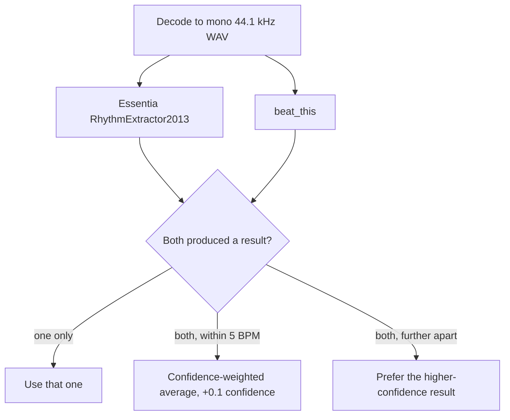

# BPM Analysis

Every audio job is analysed for tempo. The detected BPM shows up on the job page, feeds
the tempo distribution chart, guides trim selections, and is folded into the download
filename.

## The detection cascade

Two independent beat trackers run, and their answers are combined:

| Detector | Role |
|---|---|
| [Essentia](https://essentia.upf.edu/) `RhythmExtractor2013` (multifeature) | Fast baseline |
| [beat_this](https://github.com/CPJKU/beat_this) (CPJKU) | State of the art; BPM derived from the median inter-beat interval |

When the two agree within 5 BPM the result is a confidence-weighted average with a
confidence bonus, because independent agreement is itself evidence. When they disagree,
the more confident detector wins. If one fails entirely, the other is used alone; if
both fail, no tempo is recorded.

## Preprocessing

Before detection, the audio is decoded to mono 44.1 kHz WAV with a highpass filter
(`highpass=f=40`, removing sub-bass rumble that confuses beat detection) and truncated
to the **first 120 seconds**. Loudness normalization is deliberately skipped — it can
distort transients and harm beat detection. Tempo is a global property of most tracks,
and two minutes is enough to establish it without paying for the whole file.

## Normalization

Beat trackers routinely return a binary multiple of the perceived tempo — half-time or
double-time. Every detector result is folded into the **70–180 BPM** range by doubling
or halving before it is reported, so a 75 BPM track and its 150 BPM double-time reading
converge on the same answer.

Results below a confidence of `0.2` are discarded rather than reported as a low-quality
guess.

## Caching

Analysis is keyed by a hash of the audio content, not by job ID. Downloading the same
track twice — at a different quality, from a different URL, or after deleting and
re-adding it — reuses the cached tempo instead of running the detectors again.

## Non-blocking by design

Analysis runs in a separate process after the download completes. The job enters the
`analysis` status, which already counts as *downloadable*: the file can be fetched,
played, and trimmed while the tempo is still being worked out. When analysis finishes,
the job moves to `analysis_done` and the BPM appears via SSE without a reload.

## Filename tagging

A detected tempo is added to the name handed to the browser, immediately after the
title:

| On disk | Downloaded as |
|---|---|
| `Some Track.source.mp3` | `Some Track_94bpm.source.mp3` |
| `Some Track_vocals.mp3` | `Some Track_94bpm.source_vocals.mp3` |

Files keep their plain names on disk deliberately — the MP3 cache and the Lalal.ai stem
lookup both key off them. A job with no usable tempo, and every video job, keeps its
name unchanged.

## Tempo distribution

`GET /api/stats/bpm-clusters` groups every detected tempo into 5-BPM buckets, sorted by
count. This is what the dashboard's tempo chart draws.

## Limits

| Setting | Default | Meaning |
|---|---|---|
| BPM analysis track limit | 15 min | Longest audio accepted for analysis; `0` means unlimited |
| BPM analysis timeout | 5 min | Per-analysis processing timeout |
| `ANALYSIS_SEMAPHORE_LIMIT` | auto, capped at 2 | Concurrent analyses (operator-level); auto-sizing never exceeds 2 regardless of CPU count |

Audio longer than the maximum is skipped rather than analysed at cost. See
[Application Settings](../configuration/settings.md).

## Model download

The `beat_this` checkpoint (~81 MB) is fetched from `cloud.cp.jku.at` on the first
analysis. In the container `TORCH_HOME` points at `${DATA_DIR}/.cache/torch`, so it is
downloaded once and survives container recreation.

!!! note "Offline hosts"
    Without network access to that host on first use, `beat_this` is unavailable and
    the cascade falls back to Essentia alone. Tempo detection still works, with
    somewhat lower accuracy.

!!! info "Optional dependencies"
    In a standalone install without Essentia or `beat_this`, downloads work normally
    and analysis is simply skipped.
