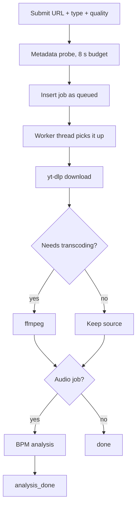

# Downloads

fetchly wraps [yt-dlp](https://github.com/yt-dlp/yt-dlp) in a web UI: format selection
happens in menus, the job runs in the background, and the result lands in a per-job
directory on your data volume.

## Supported platforms

| Platform | Video | Audio | Detected from |
|---|:---:|:---:|---|
| YouTube | :material-check: | :material-check: | `youtube.com`, `youtu.be` |
| TikTok | :material-check: | :material-check: | `tiktok.com` |
| Instagram | :material-check: | :material-check: | `instagram.com` |
| Facebook | :material-check: | :material-check: | `facebook.com`, `fb.watch` |

The platform is detected from the URL and decides which cookie jar (if any) is passed
to yt-dlp. URLs that match no known platform are rejected at submit time.

## Format selection

| Type | Quality | Behaviour |
|---|---|---|
| `video` | `max` | Best available video + audio stream |
| `video` | `medium` | Capped at 720p |
| `video` | `small` | Capped at 480p |
| `audio` | any | Audio extracted, encoded to MP3 |

### Video output format

!!! tip "Choosing between the three"
    The trade-off between resolution, file size, compatibility and CPU time gets its own
    page: [Video Codecs & Output Format](video-codecs.md). This section covers the
    mechanics.

**Settings → Processing → Output format → Video output format**
(a three-position slider, default **H.264 (Recommended)**)

This is the one setting that decides what `max` quality actually means: *the highest
resolution the source has*, or *a file that plays on every device*, or *the smallest
file*. On YouTube you cannot have the first two at once, because YouTube only encodes
H.264 up to 1080p — 1440p and 2160p exist exclusively as VP9 or AV1.

All three modes share one principle: the target is applied at **format selection**
first, so a source that already matches is downloaded and remuxed with no encoder
involved. Only a source that offers nothing matching reaches ffmpeg.

**Source** — a pure download and remux. yt-dlp picks the best rendition by
resolution, and the streams are muxed into the container they belong in: `.mp4` when
the source is H.264/AAC anyway, `.webm` for VP9/Opus, `.mkv` for AV1. With the watermark
off no encoder runs at all, so the file is bit-for-bit what the platform serves, at the
highest resolution available, in the smallest file the codec can manage; with the
watermark on the format is still kept, but the file is re-encoded (see the note below).
The cost is reach: Safari,
iOS, most smart TVs and a good deal of editing software cannot open VP9 or AV1. Jobs
whose result falls into that category are marked **Limited playback** in the job list
and in the details dialog, so a file that will not open on your phone is visible here
rather than a surprise there.

**H.264 (Recommended)** — stored as `universal`; the finished file is guaranteed to be
H.264/AAC in MP4. fetchly keeps
that promise as cheaply as it can, in two steps:

1. **At format selection**, yt-dlp is told to sort `vcodec:h264` ahead of resolution
   (`-S vcodec:h264,lang,quality,res,fps,hdr:12,acodec:aac`). Where a compatible
   rendition exists — which on YouTube is nearly always — it is simply downloaded and
   remuxed. **No encoder runs, and no quality is lost**; you only give up the
   resolutions that exist solely in VP9/AV1.
2. **Only if that fails** — a source that has no H.264 rendition at all — the file is
   re-encoded afterwards, and then only as far as necessary: if just the audio codec is
   wrong the video is stream-copied (`-c:v copy`) and only the audio becomes AAC.

**AV1** — the finished video is guaranteed to be AV1, which gives the smallest file at
a comparable quality. An AV1 rendition is preferred at format selection
(`-S vcodec:av01,…`), so on YouTube the 1440p/2160p renditions that Source would have
picked anyway are downloaded and remuxed with no encoder involved. A source without an
AV1 rendition goes through `libsvtav1`, and that is the expensive path: AV1 encoding is
much slower than H.264, so a job can spend considerably longer in `transcoding` than it
did downloading. The audio track is left exactly as it arrived — AV1 is a video codec,
and re-encoding a perfectly good Opus track alongside it would cost quality for
nothing — and the source container is kept, since AV1 is valid in `.webm`, `.mkv` and
`.mp4` alike. Reach is the same caveat as Source: AV1 does not play on Safari, iOS or
most TVs, so these jobs are marked **Limited playback** too.

Note the asymmetry: **H.264** costs resolution but almost never CPU; **Source**
costs reach but nothing else; **AV1** costs CPU whenever the source is not already AV1.
There is no mode that spends CPU to give you 4K H.264, because transcoding a 2160p AV1
source to H.264 would take longer than the download, produce a much larger file, and
still look worse than the source it came from.

The capped qualities (`medium`, `small`) are unaffected: they always re-encode to
H.264/AAC in MP4 and are therefore universally playable regardless of this setting.

!!! note "Only new downloads are affected"
    Changing the mode never touches anything already on disk — fetchly does not convert
    finished files retroactively, so a job downloaded as VP9 stays VP9 even after you
    switch to H.264. The mode is read at the moment a download starts, so a job still
    waiting in the queue picks up the new value, and retrying a failed or cancelled job
    re-downloads it under whatever mode is set then. To get an existing file in another
    format, submit it again.

!!! note "The watermark and Source"
    Burning in the watermark means running an encoder over the video, whichever mode
    is set — but that encode targets the mode's own codec, so the mode never changes
    underneath you. Under **Source** the pass re-encodes into the codec the download
    arrived in (H.264, HEVC, AV1, VP9 or VP8) and keeps the container, so the format is
    preserved even though the file is no longer a bit-exact copy of the source. A source
    in a codec fetchly has no encoder for falls back to H.264 in MP4, and the job log
    says so. Under **AV1** the watermark pass encodes AV1, which is correspondingly
    slow.

### Concurrent fragments

**Settings → General → Runtime limits → Parallel fragments per download** (`Automatic`
or `1`–`16`, default `Automatic`)

Parallel fragment downloads for DASH/HLS sources. Progressive single-file downloads
ignore it. Raise it on a fast link; lower it if a platform throttles you.

`Automatic` picks the value for each download from the host's CPU quota and free
memory — 2 fragments on a small or currently loaded container, up to 8 on a big idle
host. The setting hint names the value it resolves to right now. See
[Resources & Workers](../configuration/resources.md).

### Video watermark

**Settings → Processing → Watermark → Show Watermark** (on by default)

Burns the fetchly logo into the bottom-right corner of every downloaded **video**, with
the [public hostname](../configuration/settings.md#general) on a second line once one is
set. Audio-only jobs are untouched.

The badge is composited once per hostname and output size and cached under
`data/watermark-cache/`, so each encode only alpha-blends a still image into the corner.
On `medium` and `small` quality it rides along in the transcode fetchly already runs and
costs nothing measurable. `max` quality is otherwise a pure download and remux, so it
gains an encoding pass that a 4K download will feel — turn the switch off to leave `max`
downloads untouched. Which encoder runs follows the output format: H.264 (`libx264`) for
**H.264**, `libsvtav1` for **AV1**, and under **Source** whichever encoder matches the
codec that was downloaded. Each picks its speed setting and CRF from the source
resolution — for x264 that is `medium`/CRF 16 up to 576p, `fast`/CRF 18 up to 1080p and
`veryfast`/CRF 20 above — because a small low-bitrate source is re-quantized much more
visibly than a high-bitrate 4K one. The other encoders use their own equivalents of that
ladder, since CRF scales are not comparable between them. Audio is stream-copied unless
the compatibility promise needs it re-encoded.

The hostname line uses the Roboto Flex font shipped with the app UI
(`app/static/fonts/`); no system font package is required. If that file is missing, the
logo is drawn alone and a warning is logged. See
[Application Settings](../configuration/settings.md#processing) for the full note.

#### Your own logo

**Settings → Processing → Watermark → Custom logo**

Drop an SVG or a PNG on the zone (or click it to pick a file) to replace the fetchly
logo with your own. The logo in use — yours or the built-in one — stays on screen
underneath as a small preview on a checkerboard, so transparency reads as
transparency; the trash button beside it puts the built-in artwork back. The bundled
file is never overwritten, so this is always reversible.

A **PNG** is uploaded byte for byte. It is already what fetchly stores, so there is
nothing to convert and no re-encode to cost you quality. It needs an alpha channel:
a logo with no transparency is a box over the video, not artwork on it.

An **SVG** is rasterized **in your browser**, and only the resulting PNG is uploaded.
That is deliberate, and worth knowing about:

* The static ffmpeg builds in the Docker image have no SVG decoder, so the server
  could not render your file even if it wanted to.
* An SVG is a document that can carry scripts. Storing one and serving it back from
  fetchly's own origin would be a stored-XSS primitive. Keeping only flat pixels
  removes that class of problem entirely. (Drawing an SVG through an ``, which
  is what the drop zone does, puts it in the browser's secure static mode: no
  scripts run and no external references load.)

Either way, one PNG ends up at `data/logo/watermark-logo.png` — a single file in its
own directory on the data volume, replaced on each upload and deleted when you restore
the built-in logo.

Both sides validate, but only one of them is a boundary. The browser checks the file
before uploading it: an SVG has to parse, carry no `<script>`, `<foreignObject>` or
`on…` handlers, reference nothing outside itself, and have a determinable size from
`viewBox` or `width`/`height`; a PNG has to decode and land inside the size and shape
bounds. The server then re-derives everything from the uploaded bytes and refuses the
file unless all of it holds:

| Check | Requirement |
|---|---|
| Format | Decodes as PNG (ffprobe), non-zero size |
| Size | 32–4096 px per side, at most 2 MB |
| Shape | Aspect ratio between 1:10 and 20:1 — a wide logo is normal, a tall sliver is not |
| Transparency | An alpha channel, **and** at least one non-opaque pixel |

The transparency rule is the one that is about suitability rather than validity: a
logo with no transparency is not artwork on the video, it is a box over it, so it is
refused with that explanation rather than silently accepted.

A custom logo keeps its own proportions — the badge is laid out from the uploaded
image's aspect ratio, not the bundled logo's — and gets its own entries in the badge
cache, so replacing it can never leave the previous artwork on a video.


## The pipeline



At submit time fetchly spends at most 8 seconds probing the URL for a title and
metadata so the job list has something readable straight away. If the probe times out,
the job is still created and the worker fills the metadata in later.

## Duplicate detection

Submitting a URL that already has an **active or completed** job with the same type and
quality returns `409 Conflict` with the existing job attached. The UI surfaces this and
lets you confirm a second copy.

Errored and cancelled jobs deliberately do not count, so retrying a failed download is
never blocked.

## Cancelling and retrying

| Action | Endpoint | Notes |
|---|---|---|
| Cancel | `POST /api/jobs/{job_id}/cancel` | Terminates the running subprocess |
| Retry | `POST /api/jobs/{job_id}/retry` | Requeues the same URL, type, and quality |
| Remove all | `POST /api/jobs/remove-all` | Deletes every job and its artifacts |

## Output files

Each job gets its own directory under the data volume:

```text
/app/data/<job-uuid>/
├── <title>.source.<ext>      # what yt-dlp produced
├── <title>.mp3               # transcoded audio, when applicable
├── thumbnail.jpg             # normalized thumbnail
├── trim_<start>_<end>.wav    # trim outputs
└── trim_<...>_vocals.mp3     # Lalal.ai stems
```

The `.source` marker keeps the original download distinguishable from derived files.
The name handed to the browser can differ from the name on disk — a detected tempo is
folded in as a `_<bpm>bpm` tag at download time, while the on-disk name stays plain so
the MP3 cache and the stem lookup keep matching. See [BPM Analysis](bpm.md).

## Limits

| Limit | Default | Configure in |
|---|---|---|
| Maximum source download size | 4 GiB | Settings → General → Runtime limits |
| Download timeout | 60 min | Settings → General → Runtime limits |
| Transcode timeout | 120 min | Settings → General → Runtime limits |
| Submit rate | 10/minute | fixed |

**Maximum source download size** caps the file yt-dlp fetches from the platform, not
any file fetchly derives from it afterwards (transcode, trim, watermark). A source
above the limit fails the download.

See [Application Settings](../configuration/settings.md).

## Gated content

Public URLs work signed out. Age- or login-gated content needs an imported browser
session — see [Platform Cookies](cookies.md). A missing, invalid, or expired jar is
skipped rather than failing the job: the download simply runs signed out.

!!! note "YouTube JS challenges"
    YouTube serves JavaScript challenges that yt-dlp solves through `yt-dlp-ejs` and a
    `deno` runtime. Both are bundled in the container. In a standalone install, `deno`
    must be on `PATH` or some YouTube downloads will fail.
