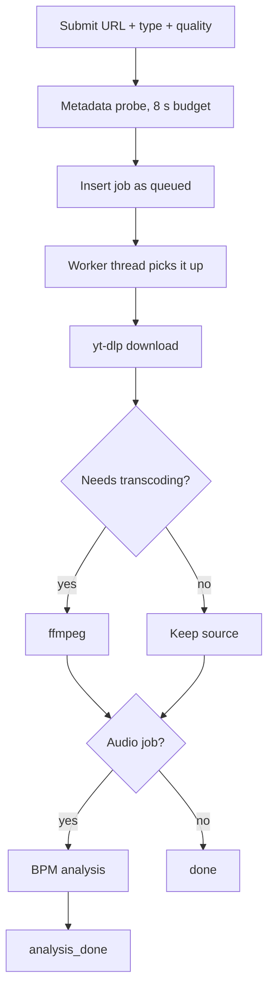

# Downloads

fetchly wraps [yt-dlp](https://github.com/yt-dlp/yt-dlp) in a web UI: format selection
happens in menus, the job runs in the background, and the result lands in a per-job
directory on your data volume.

## Supported platforms

| Platform | Video | Audio | Detected from |
|---|:---:|:---:|---|
| YouTube | :material-check: | :material-check: | `youtube.com`, `youtu.be` |
| TikTok | :material-check: | :material-check: | `tiktok.com` |
| Instagram | :material-check: | :material-check: | `instagram.com` |
| Facebook | :material-check: | :material-check: | `facebook.com`, `fb.watch` |

The platform is detected from the URL and decides which cookie jar (if any) is passed
to yt-dlp. URLs that match no known platform are rejected at submit time.

## Format selection

| Type | Quality | Behaviour |
|---|---|---|
| `video` | `max` | Best available video + audio stream |
| `video` | `medium` | Capped at 720p |
| `video` | `small` | Capped at 480p |
| `audio` | any | Audio extracted, encoded to MP3 |

### The MP4 preset

**Settings → General → MP4 preset** (on by default)

With the preset on, video jobs prefer an H.264/AAC MP4 rendition. That is the only
combination that plays in every browser — VP9 and AV1 renditions do not play in
Safari/iOS, and the job page's player, waveform, and trim view all rely on in-browser
playback.

Turn it off if you want the highest available resolution and are willing to lose
universal playback.

### Concurrent fragments

**Settings → General → Concurrent fragments** (`1`–`16`, default `3`)

Parallel fragment downloads for DASH/HLS sources. Progressive single-file downloads
ignore it. Raise it on a fast link; lower it if a platform throttles you.

## The pipeline



At submit time fetchly spends at most 8 seconds probing the URL for a title and
metadata so the job list has something readable straight away. If the probe times out,
the job is still created and the worker fills the metadata in later.

## Duplicate detection

Submitting a URL that already has an **active or completed** job with the same type and
quality returns `409 Conflict` with the existing job attached. The UI surfaces this and
lets you confirm a second copy.

Errored and cancelled jobs deliberately do not count, so retrying a failed download is
never blocked.

## Cancelling and retrying

| Action | Endpoint | Notes |
|---|---|---|
| Cancel | `POST /api/jobs/{job_id}/cancel` | Terminates the running subprocess |
| Retry | `POST /api/jobs/{job_id}/retry` | Requeues the same URL, type, and quality |
| Remove all | `POST /api/jobs/remove-all` | Deletes every job and its artifacts |

## Output files

Each job gets its own directory under the data volume:

```text
/app/data/<job-uuid>/
├── <title>.source.<ext>      # what yt-dlp produced
├── <title>.mp3               # transcoded audio, when applicable
├── thumbnail.jpg             # normalized thumbnail
├── trim_<start>_<end>.wav    # trim outputs
└── trim_<...>_vocals.mp3     # Lalal.ai stems
```

The `.source` marker keeps the original download distinguishable from derived files.
The name handed to the browser can differ from the name on disk — a detected tempo is
folded in as a `_<bpm>bpm` tag at download time, while the on-disk name stays plain so
the MP3 cache and the stem lookup keep matching. See [BPM Analysis](bpm.md).

## Limits

| Limit | Default | Configure in |
|---|---|---|
| Max input size | 4 GiB | Settings → General → Runtime limits |
| Download timeout | 60 min | Settings → General → Runtime limits |
| Transcode timeout | 120 min | Settings → General → Runtime limits |
| Submit rate | 10/minute | fixed |

See [Application Settings](../configuration/settings.md).

## Gated content

Public URLs work signed out. Age- or login-gated content needs an imported browser
session — see [Platform Cookies](cookies.md). A missing, invalid, or expired jar is
skipped rather than failing the job: the download simply runs signed out.

!!! note "YouTube JS challenges"
    YouTube serves JavaScript challenges that yt-dlp solves through `yt-dlp-ejs` and a
    `deno` runtime. Both are bundled in the container. In a standalone install, `deno`
    must be on `PATH` or some YouTube downloads will fail.
