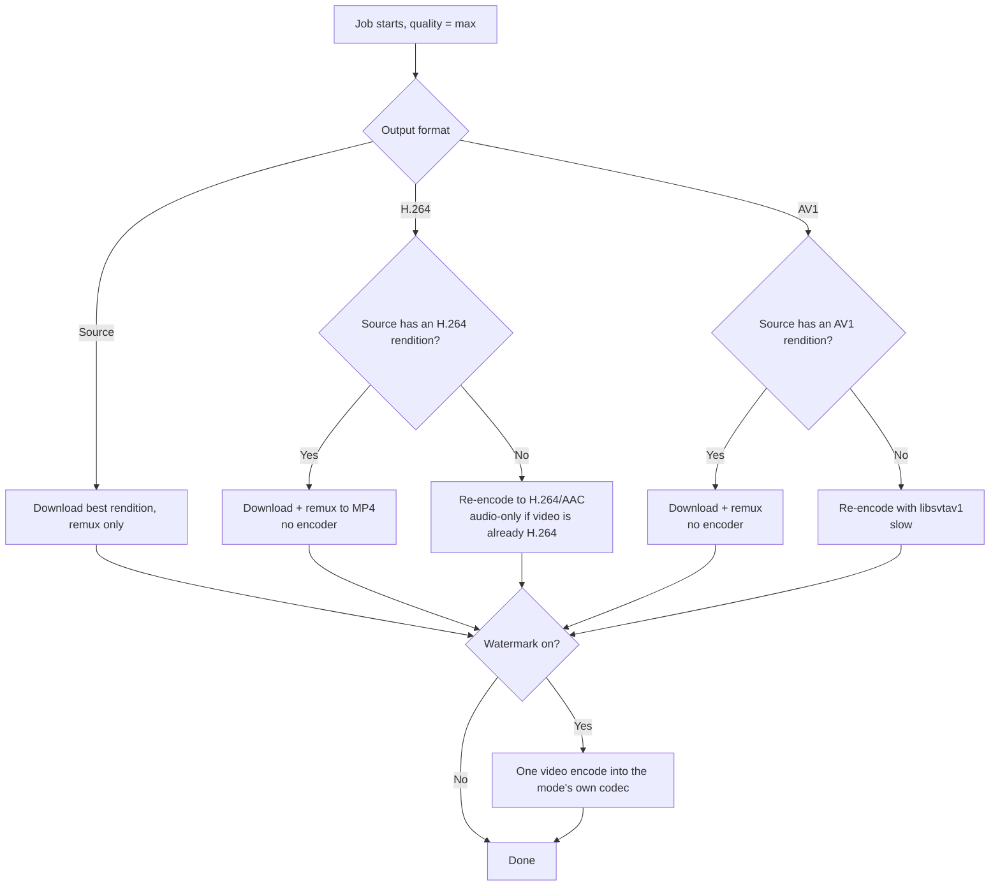

# Video Codecs & Output Format

Choosing a **Video output format** is a trade-off between three things that cannot all be
had at once: **resolution and file size**, **compatibility** (does the file open on the
device you care about?), and **CPU time** (does fetchly have to re-encode?). This page
explains why the trade-off exists and how to pick. The setting itself is described under
[Downloads](downloads.md#video-output-format) and
[Application Settings](../configuration/settings.md#processing).

## The short version

| If you want… | Choose | You give up |
|---|---|---|
| A file that plays everywhere (phone, TV, editor) | **H.264 (Recommended)** | Resolution above 1080p; some file size |
| The highest resolution, untouched, no CPU cost | **Source** | Playback on Apple devices, TVs, editors |
| The smallest file, and 1440p/2160p | **AV1** | Playback on older/Apple devices; CPU time if the source is not already AV1 |

If you are unsure, stay on **H.264**. It is the default because it is the only choice
whose result never surprises you.

## Why there is a dilemma at all

A video *codec* is the compression scheme inside the file. Three are relevant here, and
they differ in exactly the way that creates the trade-off:

| Codec | Compression efficiency | Playback support | Typical use on platforms |
|---|---|---|---|
| **H.264** (AVC) | Baseline | Universal: every browser, phone, TV, editing suite, hardware decoder | Offered by all four platforms, but on YouTube only up to 1080p |
| **VP9** | Roughly 30–40% smaller than H.264 at similar quality | Good in browsers, poor on Apple devices, TVs and in editors | YouTube's high-resolution renditions |
| **AV1** | Smallest, commonly cited as around 50% smaller than H.264 at similar quality | Newest; needs a recent decoder, and hardware support is still uneven | YouTube's high-resolution renditions, where available |

Two facts make this more than a matter of taste:

1. **Platforms decide which codec comes with which resolution.** YouTube encodes H.264
   only up to 1080p. 1440p and 2160p exist exclusively as VP9 or AV1. So "the best
   resolution" and "the most compatible codec" are, on YouTube, mutually exclusive
   properties of the *source*, before fetchly is involved at all.
2. **Better compression costs decoder capability.** The codecs that make files small are
   newer, and older or cheaper devices lack the (hardware) decoders for them. Where a
   device has no hardware decoder, playback either fails outright, stutters, or drains
   the battery.

Instagram, TikTok and Facebook generally serve H.264 already, so for those platforms the
choice matters far less. The trade-off is mostly a YouTube question.

## The three corners

Every mode sacrifices one corner of the triangle:

-   **H.264** costs *resolution and size*

    Plays everywhere, almost never needs an encoder, but is capped at 1080p on YouTube
    and produces larger files than the alternatives.

-   **Source** costs *compatibility*

    Highest resolution and no re-encoding, but the result may be VP9 or AV1 in `.webm` /
    `.mkv`, which Apple devices, most TVs and many editors cannot open.

-   **AV1** costs *CPU time and compatibility*

    Smallest file at high resolution, but only cheap when the source already offers AV1.
    Otherwise it is re-encoded slowly, and the result has the same reach problem as
    Source.

### What each mode really does to your file

| | **Source** | **H.264** | **AV1** |
|---|---|---|---|
| Resolution | Best the source offers | Up to 1080p on YouTube (best H.264 rendition) | Best AV1 rendition; up to 4K |
| File size | Whatever the source codec produces | Largest of the three at equal quality | Smallest of the three at equal quality |
| Codec of result | Whatever the platform serves (H.264, VP9, AV1, …) | Always H.264 + AAC in MP4 | Always AV1 |
| Container | `.mp4`, `.webm` or `.mkv`, matching the codec | Always `.mp4` | Source container (`.webm`, `.mkv`, `.mp4`) |
| Re-encoding | Never (watermark aside) | Only if the source has no H.264 rendition | Only if the source has no AV1 rendition |
| CPU cost | None | Almost none | None if source is AV1; **high** otherwise |
| Plays on Safari / iOS / TVs | Not guaranteed | Yes | Generally not; recent hardware only |
| Marked **Limited playback** | When VP9/AV1 | Never | Always |

## Where re-encoding happens (and where it does not)

fetchly avoids running an encoder wherever it can. Every mode first tells yt-dlp which
rendition to prefer, and only falls back to ffmpeg if nothing matching exists:

The consequence: **quality is lost only when an encoder runs**, and an encoder runs only
when the source has no rendition in the codec you asked for, or when the
[watermark](downloads.md#video-watermark) is burned in.

## Why there is no "4K H.264" mode

It is a natural question: if 4K exists only as VP9/AV1 and H.264 is the compatible one,
why not convert 4K to H.264? Because it is a bad deal in all three dimensions:

- **Time.** Decoding a 2160p stream and encoding it again takes longer than the download
  did, and needs far more CPU than the remux the other modes get away with.
- **Size.** H.264 is the least efficient of the codecs, so the file comes out much
  larger than the VP9/AV1 original.
- **Quality.** Re-encoding a lossy file is lossy again. The result looks slightly worse
  than the source it came from, at a larger size.

fetchly therefore does not offer it. If you need 4K on a device that only plays H.264,
the practical route is to download under **Source** or **AV1** and transcode on the
device or machine that needs it, with your own settings.

## Choosing: common situations

=== "I just want it to play"

    Use **H.264**. The file opens on phones, TVs, browsers and editors, and no CPU is
    spent on it in the usual case. You get up to 1080p on YouTube, which is enough for
    almost all screens.

=== "I archive, and storage matters"

    Use **AV1** if the videos are YouTube and you play them on a computer or a recent
    device: it is the smallest, and 1440p/2160p sources that are already AV1 cost no
    encode at all. Expect long `transcoding` times for sources that are not AV1, and
    check that your player handles it before committing a whole library.

=== "I want the best picture and will edit or process it"

    Use **Source**. Nothing is re-encoded, so the picture is exactly what the platform
    delivered, in the highest resolution. Check that your editor can open VP9/AV1, or
    convert the file once on your own machine.

=== "I share files with other people"

    Use **H.264**. You cannot know what the recipient's device supports, and a file that
    will not open is worse than a slightly larger one. The file is stored in the
    format you chose at download time, and that is what a recipient gets.

=== "I run fetchly on a small server"

    Prefer **H.264** or **Source**. AV1 can spend many minutes per video in
    `transcoding`, which blocks a transcode slot (see
    [Resources & Workers](../configuration/resources.md)) and delays everything queued
    behind it.

## Notes and caveats

!!! warning "Compatibility is a moving target"
    AV1 support depends on the device: recent phones, computers and TVs increasingly
    decode it in hardware, while older ones cannot, or only in software. The interface
    describes AV1 as having *limited Apple support*, which is accurate for older Apple
    hardware and shifts as devices are replaced. When it matters, test one file on the
    devices you care about before switching a library over.

!!! note "Only new downloads are affected"
    Changing the format never touches finished files. A job downloaded as VP9 stays VP9
    after you switch to H.264. To get an existing video in another format, submit it
    again. See [Downloads](downloads.md#video-output-format).

!!! note "The capped qualities are not affected"
    `medium` (720p) and `small` (480p) always produce H.264/AAC in MP4, whatever this
    setting says. The trade-off on this page applies to `max` only.

!!! note "The watermark costs an encode in every mode"
    Burning in the watermark runs an encoder, but into the mode's own codec, so the
    watermark never changes the format you chose. Under **AV1** that encode is slow. If
    you want a bit-exact **Source** file, switch the watermark off. See
    [Downloads](downloads.md#video-watermark).

## Related

- [Downloads → Video output format](downloads.md#video-output-format): mechanics and yt-dlp sort expressions
- [Application Settings → Processing](../configuration/settings.md#processing): the `download_output_mode` key
- [Job Dashboard](jobs.md): the **Limited playback** marker
- [Troubleshooting](../troubleshooting.md): "Video will not play on my device"
