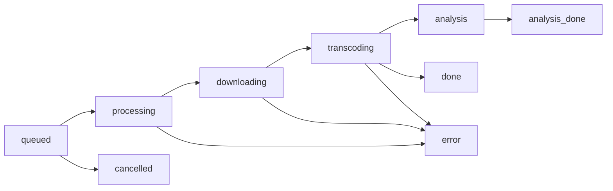

# First Steps

A walkthrough of the first things you will do in a fresh fetchly instance.

## 1. Create an admin account

**Settings → Security**

Authentication is off on a fresh install and there is no built-in account. Saving an
admin username and password is what switches the login on — the toggle cannot be
enabled before credentials exist.

| Field | Notes |
|---|---|
| Admin username | Normalized on save; stored in the `admin_username` setting |
| Password | Hashed with PBKDF2-HMAC-SHA256; only the hash is stored |
| Enable authentication | Becomes available once credentials are stored |

Once enabled, every page and every API route requires a session. See
[Authentication](../security/authentication.md).

## 2. Queue your first download

On the dashboard:

1. **Paste a URL** from YouTube, TikTok, Instagram, or Facebook
2. fetchly resolves the **title, thumbnail, and duration** as a preview
3. Choose the **type** and **quality**:

    | Type | Quality | Result |
    |---|---|---|
    | Video | `Max` | Best available video stream |
    | Video | `720p` | Capped at 720p |
    | Video | `480p` | Capped at 480p |
    | Audio | any | Audio extracted and encoded to MP3 |

4. Press **Download**

The job is inserted as `queued` and picked up by a worker thread. Progress streams to
the browser over Server-Sent Events — see [Job Dashboard](../features/jobs.md).

!!! info "Duplicate detection"
    Submitting a URL that already has an active or completed job with the same type and
    quality returns a conflict, and the UI asks whether you really want a second copy.
    Errored and cancelled jobs never block a resubmission, so retrying after a failure
    always works.

## 3. Watch the job run

A job moves through these statuses:

| Status | Meaning |
|---|---|
| `queued` | Waiting for a free worker slot |
| `processing` | Metadata extraction and format selection |
| `downloading` | yt-dlp is fetching the media |
| `transcoding` | ffmpeg is converting to the target format |
| `analysis` | Audio job: BPM detection running (file is already downloadable) |
| `analysis_done` | Analysis finished — terminal |
| `done` | Finished without analysis — terminal |
| `error` | Failed; the message is shown in the UI and the job can be retried |
| `cancelled` | Cancelled by the user — terminal |

## 4. Work with the result

From a finished job you can:

- **Download** the file
- Open the **job page** for the player and the waveform
- **Trim** a segment out of an audio track — [Audio Trimming](../features/trimming.md)
- **Separate stems** if Lalal.ai is connected — [Stem Separation](../features/stems.md)
- **Share** it with a token link — [Share Links](../features/sharing.md)
- **Retry** it if it failed

## 5. Tune the defaults

**Settings → General**

| Setting | Default | Effect |
|---|---|---|
| Retention | `0` (unlimited) | Days before job files are swept; `0` keeps them forever |
| Prefer H.264/AAC for max quality | On | Prefer H.264/AAC in MP4 for universal in-browser playback |
| Show fetchly watermark | On | Burns the fetchly logo, plus the public hostname when set, into the bottom-right corner of every video |
| Parallel fragments per download | `Automatic` | Parallel fragment downloads for DASH/HLS sources, sized from the host's CPU quota and free memory |
| Share link max uses | `0` (unlimited) | How often a newly created share link may be redeemed |
| Public hostname | empty | Hostname share links are built from behind a reverse proxy |

Details in [Application Settings](../configuration/settings.md).

## 6. Optional: reach gated content

Public URLs work signed out. For age- or login-gated content, import a signed-in
browser session per platform under **Settings → Integrations** — see
[Platform Cookies](../features/cookies.md).

## 7. Optional: connect Lalal.ai

Enter your Lalal.ai **activation key** under **Settings → Integrations** to unlock
vocals/instrumental separation on finished audio jobs. No environment variable is
involved — see [Stem Separation](../features/stems.md).

## Next

-   :material-server-network:{ .lg .middle } **Put it behind TLS**

    ---

    [:octicons-arrow-right-24: Reverse Proxy](../configuration/reverse-proxy.md)

-   :material-tune:{ .lg .middle } **Size it for your host**

    ---

    [:octicons-arrow-right-24: Resources & Workers](../configuration/resources.md)

-   :material-lifebuoy:{ .lg .middle } **Something went wrong**

    ---

    [:octicons-arrow-right-24: Troubleshooting](../troubleshooting.md)

