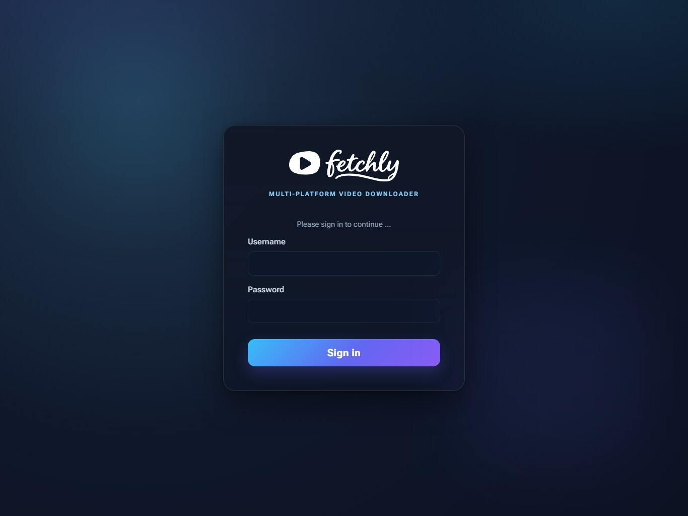

---
hide:
  - navigation
---

# fetchly

<p align="center">
  
  
</p>

<p align="center">
  <strong>Self-hosted media downloader for YouTube, TikTok, Instagram &amp; Facebook</strong>
</p>

<p align="center">
  <a href="https://github.com/Gill-Bates/fetchly/releases"></a>
  <a href="https://hub.docker.com/r/giiibates/fetchly"></a>
  <a href="https://github.com/Gill-Bates/fetchly/blob/main/LICENSE"></a>
</p>

---

## What is fetchly?

fetchly is a single-container web application that turns `yt-dlp` into something you
can hand to a browser. Paste a link, preview the media, pick a format, and watch the
job run on a live dashboard — no command-line flags, no one-shot invocations.

Beyond downloading, fetchly trims audio on an interactive waveform, detects tempo with
two independent beat trackers, and — with an optional Lalal.ai key — separates vocals
from instrumentals. Everything runs on your own hardware, against a SQLite database on
a volume you control.

## Key Features

<div class="grid cards" markdown>

-   :material-download:{ .lg .middle } **Download Everywhere**

    ---

    Video or audio from YouTube, TikTok, Instagram, and Facebook, with format and
    quality picked from menus instead of `yt-dlp` flags.

    [:octicons-arrow-right-24: Downloads](features/downloads.md)

-   :material-view-dashboard:{ .lg .middle } **Live Job Dashboard**

    ---

    Queued, active, completed, and failed jobs stream to the browser over
    Server-Sent Events — no polling, no page reloads.

    [:octicons-arrow-right-24: Job Dashboard](features/jobs.md)

-   :material-waveform:{ .lg .middle } **Waveform Trimming**

    ---

    Cut a segment out of a downloaded track visually with wavesurfer.js, then export
    the trimmed audio without re-downloading.

    [:octicons-arrow-right-24: Audio Trimming](features/trimming.md)

-   :material-metronome:{ .lg .middle } **BPM Analysis**

    ---

    Tempo and beat confidence from a `beat_this` / Essentia cascade, cached by audio
    hash and folded into the download filename.

    [:octicons-arrow-right-24: BPM Analysis](features/bpm.md)

-   :material-microphone-variant:{ .lg .middle } **Stem Separation**

    ---

    Connect a Lalal.ai activation key to split vocals and instrumentals from any
    finished audio job.

    [:octicons-arrow-right-24: Stem Separation](features/stems.md)

-   :material-share-variant:{ .lg .middle } **Share Links**

    ---

    Hand out an unguessable link to a finished download. Recipients need no account,
    and you can cap how often each link works.

    [:octicons-arrow-right-24: Share Links](features/sharing.md)

-   :material-cookie:{ .lg .middle } **Platform Cookies**

    ---

    Paste a *Copy as cURL* command from your browser to reach age- or login-gated
    content, per platform.

    [:octicons-arrow-right-24: Platform Cookies](features/cookies.md)

-   :material-shield-lock:{ .lg .middle } **Hardened by Default**

    ---

    Optional authentication, CSRF double-submit tokens, invisible anti-bot checks,
    per-route rate limits, and a non-root container.

    [:octicons-arrow-right-24: Security Overview](security/overview.md)

</div>

## Quick Start

```bash
export FETCHLY_SECRET_KEY="$(openssl rand -base64 32)"

docker run --rm \
  -p 8000:8000 \
  -e FETCHLY_SECRET_KEY \
  -v "$PWD/data:/app/data" \
  giiibates/fetchly:latest
```

!!! success "First Access"
    Open `http://127.0.0.1:8000`. Authentication is **off** on a fresh install and
    there is no built-in account — create an admin username and password under
    **Settings → Security** to require a login.

!!! warning "Never expose an unauthenticated instance"
    With authentication off, anyone who can reach the port can queue downloads and
    read every finished file. Enable authentication before binding to anything other
    than localhost.

[:material-rocket-launch: Full Installation Guide](getting-started/installation.md){ .md-button .md-button--primary }
[:material-book-open-page-variant: Quick Start](getting-started/quick-start.md){ .md-button }

## Screenshots

=== "Dashboard"
    

=== "Login"
    

## Supported Platforms

| | Platform | Video | Audio |
| --- | --- | :---: | :---: |
|  | **YouTube** | :material-check: | :material-check: |
|  | **TikTok** | :material-check: | :material-check: |
|  | **Instagram** | :material-check: | :material-check: |
|  | **Facebook** | :material-check: | :material-check: |

Public URLs work without account cookies. Age- or login-gated content may work after
importing a current signed-in session under **Settings → Integrations**; platforms can
still reject stale or revoked sessions.

## Why fetchly?

| | fetchly | Plain `yt-dlp` |
|---|---|---|
| Interface | Web UI with format menus | CLI flags |
| Job tracking | Live dashboard with SSE | One-shot command |
| Audio trimming | Interactive waveform | Manual `ffmpeg` |
| Tempo detection | Built-in, cached | Not available |
| Stem separation | Lalal.ai integration | Not available |
| Sharing | Token links with use limits | Copy files yourself |
| Deployment | One Docker image | Install and maintain yourself |

## Built With

- [yt-dlp](https://github.com/yt-dlp/yt-dlp) + [yt-dlp-ejs](https://github.com/yt-dlp/ejs) and [deno](https://deno.land) — media extraction and YouTube JS-challenge solving
- [ffmpeg](https://ffmpeg.org/) — transcoding, audio trimming, and waveform generation
- [beat_this](https://github.com/CPJKU/beat_this) and [Essentia](https://essentia.upf.edu/) — BPM and beat-confidence analysis
- [wavesurfer.js](https://wavesurfer.xyz/) — browser-based waveform display and trim UI
- [FastAPI](https://fastapi.tiangolo.com/), [Gunicorn](https://gunicorn.org/) and [Uvicorn](https://uvicorn.dev/) — application framework and ASGI server
- [Lalal.ai](https://www.lalal.ai/) — optional vocals/instrumental stem separation

## Community & Support

<div class="grid" markdown>

[:fontawesome-brands-github: GitHub Repository](https://github.com/Gill-Bates/fetchly){ .md-button }
[:fontawesome-brands-docker: Docker Hub](https://hub.docker.com/r/giiibates/fetchly){ .md-button }
[:material-bug: Report Issues](https://github.com/Gill-Bates/fetchly/issues){ .md-button }

</div>

## License

fetchly is licensed under the [GNU Affero General Public License v3.0](https://github.com/Gill-Bates/fetchly/blob/main/LICENSE).

---

<p align="center">
  Made with ☕ by <a href="https://github.com/Gill-Bates">Gill-Bates</a>
</p>
