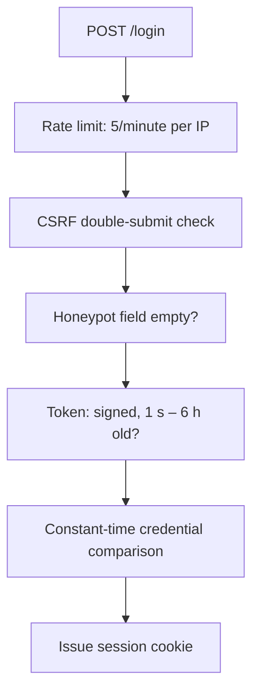

# Anti-Bot Protection

`POST /login` is the one endpoint reachable before authentication, so it is the one
credential-stuffing bots find. fetchly guards it with an invisible check that requires
no user interaction — no puzzles, no images, no third-party service.

## The two signals

### 1. Honeypot field

The login form renders a field named `website`, hidden from humans with CSS
(`.hp-field`, positioned off-screen) but present in the DOM.

A real user never sees it and never fills it. Many automated form-fillers populate every
input they find, so a non-empty value is a strong bot signal with effectively zero false
positives.

### 2. Signed time-trap token

The login page embeds a token minted when the page is served, signed with
`FETCHLY_SECRET_KEY` — the same anchor the session cookie uses, but under a distinct
signing salt (`fetchly-hidden-captcha`) so a value minted for one can never be replayed
as the other.

On submit the token must:

| Requirement | Catches |
|---|---|
| Be present with a valid signature | A bot POSTing straight at the endpoint without loading the page |
| Not be older than **6 hours** | A stale form left open, or a harvested token reused much later |
| Not be **younger than 1 second** | A form submitted implausibly fast after being served |

Tokens are valid until expiry and are **not** single-use — a legitimate user who
mistypes their password and retries is not punished for it.

## Uniform rejection

Every failing signal — honeypot filled, token missing, signature invalid, token
expired, token too fresh — produces the **same** message:

> We couldn't verify your submission. Please reload the page and try again.

A caller can never learn which invisible check tripped, which is what keeps the checks
from being tuned around one at a time.

## Why not a CAPTCHA

| | Hidden check | Third-party CAPTCHA |
|---|---|---|
| User interaction | None | Puzzles or image grids |
| External dependency | None | A vendor endpoint on every login |
| Privacy | Nothing leaves the instance | Client data sent to the vendor |
| Accessibility | Unaffected | A known barrier |
| Offline / air-gapped | Works | Breaks |

The trade-off is that this stops opportunistic and scripted abuse, not a determined
attacker who studies the form. That is what the login [rate limit](rate-limiting.md) of
5/minute is for.

## Implementation notes

No third-party dependency is involved. fetchly already hand-rolls HMAC-based token
signing for sessions, so the anti-bot token follows the same
`base64url(payload + hmac)` shape rather than pulling in a package for one small use.

## Interaction with the secret key

Rotating `FETCHLY_SECRET_KEY` invalidates every token that was already handed out.
Users with the login page open get the generic rejection and a reload fixes it — worth
knowing before you rotate.

## Layering

Each layer stops a different class of caller: the rate limit stops volume, CSRF stops
cross-site submission, the hidden check stops naive automation, and the constant-time
comparison stops timing analysis.
