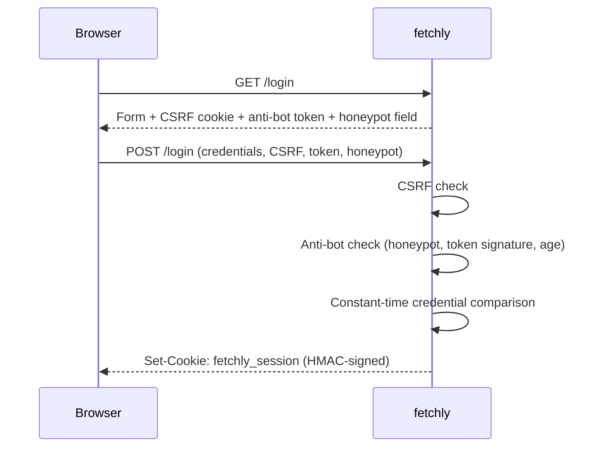

# Authentication

fetchly has a single admin identity. Authentication is optional, off by default, and
enabled by creating the account.

## Enabling it

**Settings → Security**

1. Enter an **admin username**
2. Enter a **password** twice
3. Save

| Field | Rules |
|---|---|
| Username | Letters, hyphens, and underscores only; at most 64 characters |
| Password | 8–1024 characters; never trimmed, so leading and trailing spaces count |

Username and password are always saved as a **pair**: the PBKDF2 salt is derived from
the username, so renaming the account requires re-hashing and therefore the plaintext
password.

Storing credentials is what makes the **Enable authentication** toggle available. The
settings API refuses to set the flag while no username and password hash exist, so an
"enabled but no account" state is not reachable through the UI or the API.

!!! info "No environment variable, no bootstrap password"
    Credentials exist only in the database. Nothing in the environment can set,
    override, or recover them. There is also no generated first-run password to find in
    the logs.

## Password storage

```text
salt   = SHA-256(FETCHLY_SECRET_KEY : username : "salt")
pepper = SHA-256(FETCHLY_SECRET_KEY : "pepper")
hash   = PBKDF2-HMAC-SHA256(password + pepper, salt, 200_000)
```

| Property | Value |
|---|---|
| Algorithm | PBKDF2-HMAC-SHA256 |
| Iterations | 200,000 |
| Salt | Derived per username from the secret key |
| Pepper | Derived from the secret key |
| Comparison | Constant-time, on both username and hash |

The candidate hash is computed against the **stored** username, not the submitted one,
because the salt is username-derived.

!!! warning "Rotating `FETCHLY_SECRET_KEY` invalidates the password"
    Salt and pepper come from the key. Change it and the stored hash can never match
    again — you would need to reset the credentials directly in the settings table.

## The login flow



Rate limits: `GET /login` 20/minute, `POST /login` 5/minute, `POST /logout` 20/minute.

Failed logins return one generic message. A failed anti-bot check returns a different
generic message that is identical for every failing signal, so a caller can never learn
which check tripped.

## Sessions

| Property | Value |
|---|---|
| Cookie | `fetchly_session` |
| Contents | Username, issue time, last activity, nonce, session version — HMAC-signed |
| `HttpOnly` | Yes |
| `SameSite` | `Lax` |
| `Secure` | When `FETCHLY_BEHIND_HTTPS=1` or the request arrived over HTTPS |
| Hard limit | 24 hours from login (not configurable) |
| Idle timeout | Sliding, `session_idle_minutes` (1–1440, default 60) |

A session is valid only while **all** of these hold:

1. The signature verifies
2. The hard 24-hour limit has not passed
3. The last activity is within the idle timeout
4. The embedded session version matches the current one

Cookie `Max-Age` is the smaller of the remaining hard and idle budgets, so the browser
discards the cookie exactly when the server stops accepting it.

### Idle timeout

**Settings → Security → Session idle timeout**, 1–1440 minutes, default 60. The window
slides: each authenticated request refreshes it.

### Invalidating every session

Bumping the internal `session_version` invalidates all outstanding sessions at once.
It is bumped automatically whenever the credentials change — the credential those
sessions were issued against no longer exists.

## Authorization

Every route requires the session. Because there is exactly one identity and the jobs
table has no owner column, "is there a valid session?" is the complete check.

When authentication is **off**, the dependencies still need a principal, so requests
run as the internal identity `local`. That is never a login name — with authentication
off there is no login at all.

Unauthenticated by design:

| Route | Why |
|---|---|
| `GET /health` | Orchestrator health probes |
| `GET /login`, `POST /login` | The login itself |
| `GET /share/{token}` | Share links are meant for people without accounts |
| `GET /static/*` | Assets |

## API access

There is no API token or bearer scheme. Automation uses the same session cookie a
browser gets — see [API Authentication](../api/authentication.md).

## Recovering a lost password

There is no reset flow. With shell access to the data volume, clear the flag directly:

```bash
docker compose stop
sqlite3 data/jobs.db "UPDATE settings SET value='false' WHERE key='enable_authentication';"
docker compose start
```

The instance is then unauthenticated. Set new credentials immediately under
**Settings → Security**, and do this only while the port is not publicly reachable.
